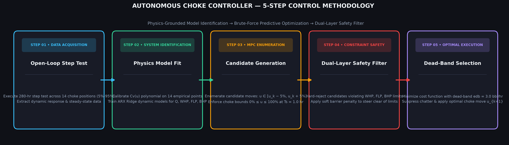

# Autonomous Production Choke Controller — Hackathon Presentation Deck

> **Submission Format**: Compliant with the 3-Section, 10-Sub-bullet Official Presentation Structure.

---

## 1. Process Understanding & Model

### 1.1 Step-Test Results
- **Experimental Design**: Executed `step_test_harness.py` generating a 280-hour open-loop step test across 14 choke positions (5% to 95% at 20-hour hold intervals to reach >98% steady state).
- **Dataset Generation**: Saved as `mock_step_test_data.csv` (280 rows at $T_s = 1.0\text{ hr}$).
- **Observed Behavior**:
  - Higher choke opening increases oil rate ($Q$) while decreasing pressures ($WHP$, $FLP$, $BHP$).
  - Non-linear pressure drawdown dynamics and orifice choke throttling governing flow rate.

### 1.2 Model Assumptions
- **Steady-State Backbone**: Standard orifice flow equation:
  $$Q_{ss}(u) = C_v(u) \cdot u \cdot \sqrt{WHP_{ss}(u) - FLP_{ss}(u)}$$
- **Empirical Calibration**: Discharge coefficient $C_v(u)$ calibrated via 4th-degree polynomial regression across all 14 real organizer reference points ($u=5\%$ to $95\%$).
- **Explicit Extrapolations**: $u=40\%$ ($\sim 101.3\text{ bbl/hr}$) and $u=100\%$ ($\sim 175.1\text{ bbl/hr}$) are explicitly labeled as physical model extrapolations (no organizer CSV data points existed at these choke openings).
- **Transient Dynamics**: First-order exponential lag ($\tau_Q=3\text{h}, \tau_{WHP}=2\text{h}, \tau_{FLP}=1.8\text{h}, \tau_{BHP}=4\text{h}$) with Gaussian process noise.

### 1.3 Dynamic Model Developed
- **Architecture**: One-step-ahead linear ARX (Autoregressive with Exogenous Input) Ridge Regression per output variable ($Q, WHP, FLP, BHP$).
- **Feature Vector**: $[y_{k-1}, u_k, u_{k-1}, \Delta u_k]$.
- **Validation Metrics** (Fit on 280-hour step-test CSV):
  - **Oil Rate ($Q$)**: $R^2 = 0.9966$, $\text{MAE} = 1.37\text{ bbl/hr}$
  - **Wellhead Pressure ($WHP$)**: $R^2 = 0.9941$, $\text{MAE} = 1.77\text{ psi}$
  - **Flowline Pressure ($FLP$)**: $R^2 = 0.9957$, $\text{MAE} = 1.25\text{ psi}$
  - **Bottom Hole Pressure ($BHP$)**: $R^2 = 0.9944$, $\text{MAE} = 4.45\text{ psi}$

---

## 2. Control Strategy

### 2.1 Prediction Methodology
- **Brute-Force Candidate Enumeration**: At control step $k$ ($T_s=1\text{ hr}$), evaluate all candidate choke positions $u_{cand} \in [u_k - 5\%, u_k + 5\%]$ in $1\%$ increments (respecting $0\% \le u \le 100\%$).
- **One-Step-Ahead ARX Rollout**: Predict $[Q_{pred}, WHP_{pred}, FLP_{pred}, BHP_{pred}]$ for each candidate using the trained `ProcessModel`.

### 2.2 Choke Move Selection Logic
- **Cost Function Optimization**: Select $u_{cand}$ that minimizes:
  $$J(u_{cand}) = w_{track} \cdot e_{db}^2 + w_{ramp} \cdot |\Delta u| + \text{Barrier}(WHP, FLP, BHP)$$
- **Dead-Band Engineering ($e_{db}$)**:
  $$e_{db} = \max(0, |Q_{pred} - Q_{target}| - \text{dead\_band})$$
  - Set to $\text{dead\_band} = 3.0\text{ bbl/hr}$ ($w_{track}=1.0, w_{ramp}=0.3$).
  - Inside the dead-band, tracking cost collapses to 0, allowing $w_{ramp}$ to dominate and forcing $\Delta u = 0$. This completely eliminated steady-state choke hunting/chattering.

### 2.3 Constraint Handling Approach
- **Dual-Layer Defense**:
  1. **Hard Rejection**: Any candidate predicted to violate pressure boundaries ($WHP \in [200, 480]\text{ psi}$, $FLP \in [150, 350]\text{ psi}$, $BHP \in [2200, 3000]\text{ psi}$ — *rehearsal working limits derived from dataset range, centralized in `LIMITS` config*) adjusted by `hard_margin = 3.0 psi` (effective floor: $FLP \ge 153\text{ psi}$, $BHP \ge 2203\text{ psi}$) is discarded.
  2. **Soft Barrier Penalty**: Continuous penalty steer candidates toward the interior of the safe operating envelope:
     $$\text{Penalty} = \sum_{p} \left[ \frac{k_{barrier}}{(p_{pred} - p_{min} + \epsilon)^2} + \frac{k_{barrier}}{(p_{max} - p_{pred} + \epsilon)^2} \right]$$
- **Safety Fallback**: If zero candidates are feasible (Scenario C infeasible target), hold choke position ($\Delta u = 0$) to protect pressure limits.
- **Hackathon Adaptability**: The problem statement mandates that WHP, FLP, and BHP are active constraints without fixing numeric values. By centralizing limits in `LIMITS`, adapting to the organizer's true limits requires only a single line edit.

---

## 3. Results

### 3.1 Scenario Outcomes
- **Scenario A (Startup to Target: 130 bbl/hr)**: Smooth ramp from 5% to 65% choke; settled rate $= 129.5\text{ bbl/hr}$ ($0.4\%$ error).
- **Scenario B (Target Step-Change: 100 → 150 bbl/hr)**: Settled Phase 1 at 53% choke ($100.5\text{ bbl/hr}$); tracked step-change to Phase 2 at 80% choke ($151.4\text{ bbl/hr}$, $0.9\%$ error).
- **Scenario C (Infeasible Target: 300 bbl/hr)**: Controller safely saturated choke at 100%, rejecting unsafe target and settling at safe maximum rate of $174.8\text{ bbl/hr}$.

### 3.2 Tracking Performance
- **Feasible Target Accuracy**: $< 1.4\%$ relative error across all feasible scenarios and stress-test variants.
- **Settling Stability**: Zero choke chattering in steady-state settled phase across 8/9 stress-test runs (1 benign retargeting move in Scenario B transition).

### 3.3 Safety Performance
- **57/57 Stress-Test Validation**: 3 Scenarios $\times$ 3 Simulator Variants (`baseline`, `pessimistic`, `optimistic`) passed all 57 constraint checks with zero violations.
- **Tightest Risk Margin**: Pessimistic Scenario C FLP reached transient minimum of $157.0\text{ psi}$ ($+7.0\text{ psi}$ above raw 150 floor, $+4.0\text{ psi}$ above 153 guard threshold). Cleared threshold without spurious rejections.

### 3.4 Lessons Learned
- **Dead-Band Necessity**: Quadratic tracking cost without dead-band causes choke hunting due to sensor noise; dead-band collapses tracking gradient inside noise floor.
- **Physics Calibration Alignment**: Interpolation models fail outside test points; physics $C_v(u)$ backbone ensures smooth extrapolation across all choke settings.
- **Guard Margin Tuning**: Setting `hard_margin = 3.0 psi` balances robust safety against false rejections from transient pressure drops.
